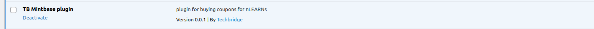
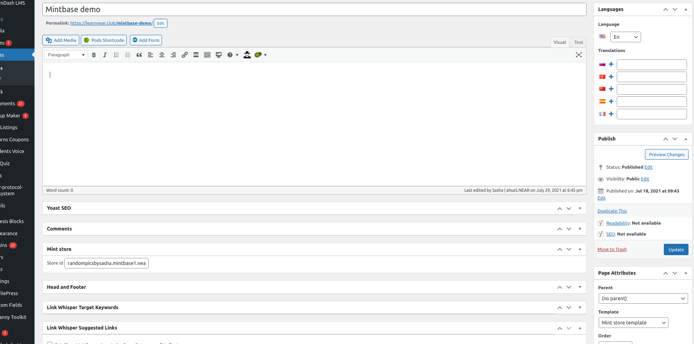
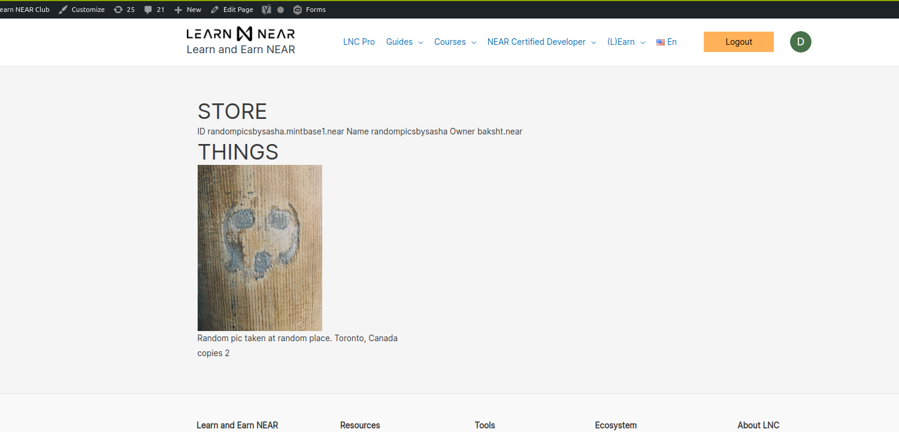

# mintbase-embed
 WordPress plugin people can use to embed to their website:  a Mintbase NEAR NFT  and  Mintbase NEAR store
 ## This is demo plugin that allows to grab and show data from mintbase by store id with using get params
 
1) Activate plugins in wp-plugins tab

2) Create page with pate template - Mint store template, and add store id to page 

3) Go to this page to see your store

4) Click to the image in listing to see store product data

